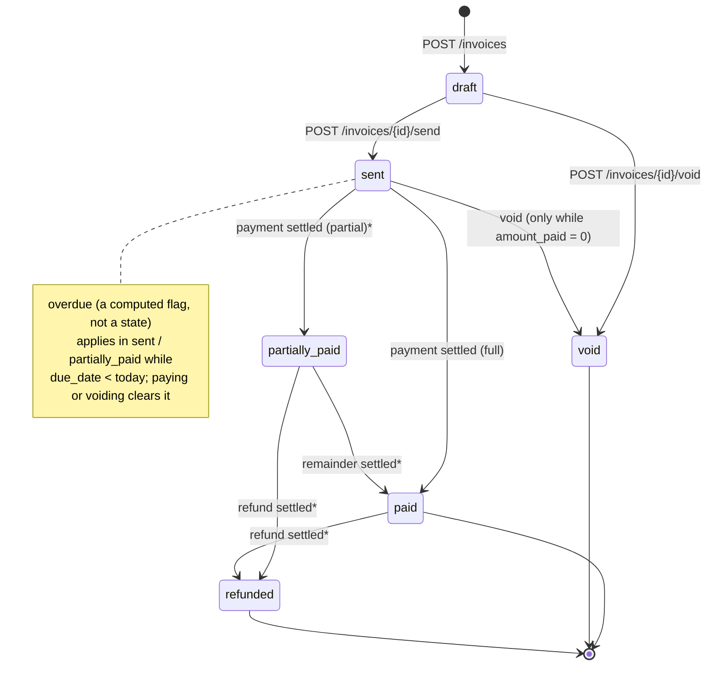

# Design notes

## Shape of the system

`api` is the service: Axum handlers plus two in-process background loops, the
webhook dispatcher and the payment reconciler.

`mock-psp` stands in for the provider, and it has two personalities (`alphapay`,
`betapay`) with different wire formats on purpose.

Boot runs migrations as a `migrator` role that owns the schema, then
re-applies `sql/rls.sql` in full: every grant, helper function, and RLS
policy, declarative and idempotent, so the database's security posture is
one file you can read rather than a chain of `ALTER POLICY` migrations. The
API then serves on a second connection as `invoice_app`, which owns no
tables and has no `BYPASSRLS`.

Auth middleware authenticates the bearer credential and looks the route
up in a static scope table. A route missing from the table is rejected, so
forgetting to authorise a new endpoint fails the first test instead of
shipping open.

The handler then opens a transaction whose first statement is
`set_config('request.jwt.claims', <claims JSON>, true)`, a transaction-local
setting every RLS policy reads. Handlers still write `WHERE business_id = $1`
out of hygiene, but if I forget one, Postgres runs the same tenant-and-scope
check and returns nothing.

Background work is cross-tenant by nature, so those transactions do
`SET LOCAL ROLE invoice_service`, a role with broad policies on exactly four
tables. `invoice_app` holds that role with `INHERIT FALSE`: the request path
never carries cross-tenant access ambiently, and the elevation dies at COMMIT.

## Data model

UUIDv7 primary keys, generated in the app: time-sortable, no sequence
round-trip. Externally they wear a type prefix (`inv_`, `cus_`, `pa_`), so a
customer id pasted into an invoice route is a 400 at parse time, not a
confusing 404. Every tenant-owned row carries `business_id` directly, child
tables included; it's the RLS anchor and I didn't want a policy to need a
join to find it. Money is `BIGINT` cents; there is no float in the money path.

| Table | What matters |
|---|---|
| `api_keys` | 8-char `key_prefix` in the clear, SHA-256 `key_hash` of the full key, `permissions TEXT[]`, `revoked_at`, `last_used_at` |
| `invoices` | `state`, server-computed `total_cents`, `amount_paid_cents`, and three CHECKs so state and money can't disagree: `paid ⇒ paid = total`, `void ⇒ paid = 0`, `0 ≤ paid ≤ total` |
| `invoice_line_items` | Immutable after creation. A sent document's total is a fact; corrections are a new invoice |
| `payment_attempts` | `pending / succeeded / failed`, the `processor`, a `reconcile_attempts` counter. The attempt id is the idempotency reference sent to the provider |
| `idempotency_keys` | `UNIQUE (business_id, key)`, request hash, stored response for byte-identical replay |
| `webhook_endpoints` | url, signing secret (shown once), `disabled_at` |
| `webhook_deliveries` | The outbox: stable `event_id`, payload, status, attempt count, `next_attempt_at`, `last_error` |

Every index exists for one query, and the load-bearing ones are partial:

- `UNIQUE (api_keys.key_prefix)`: auth is one indexed lookup, then a
  constant-time hash compare. No scan.
- `UNIQUE (payment_attempts.invoice_id) WHERE status = 'pending'`: the
  concurrency backbone (§4).
- `(business_id, due_date) WHERE state IN ('sent','partially_paid')`: the
  overdue scan only carries collectible rows.
- `(updated_at) WHERE pending` on attempts and `(next_attempt_at) WHERE
  pending` on deliveries: the two background sweeps.
- `(business_id, created_at DESC, id DESC)`: keyset pagination, no `OFFSET`.

Nothing has `DELETE` granted. Keys get `revoked_at`, endpoints get
`disabled_at`, because "which credential was live then" is an audit question
a deleted row can't answer.

## Invoice state machine



Starred transitions (*) are designed but have no endpoint yet.

`/pay` always charges the full balance.

`paid`, `void`, `refunded` are terminal, with one asymmetry: `paid` has a
single exit, a refund. Money goes back forward, through a state that
leaves a record, never by reverting. Nothing is reversible.

Void is only allowed while nothing has been paid, enforced three times: in
`transition()`, in the UPDATE's `WHERE amount_paid_cents = 0`, and in a CHECK
constraint. That's paranoid until you picture explaining a voided-but-paid
invoice in an audit.

`overdue` is a flag computed at read time (collectible and past due). A
stored flag needs a nightly job, and between midnight and that job the
database is asserting something the calendar disagrees with.

## Paying an invoice

Charging a card and recording the charge can't be atomic. The design choice
is where the seam goes. `POST /invoices/{id}/pay` runs in three phases, and
no transaction is ever held across the provider call:

1. Claim (short tx): insert the idempotency key, `SELECT … FOR UPDATE`
   the invoice, check state, insert a `pending` attempt, commit. Any failure
   rolls all of it back, so a request that never reached the provider doesn't
   burn the caller's key. After this commit the key is spent, because money
   might move.
2. Charge (no tx): call the adapter with a 5 s timeout, passing the
   attempt id as the provider-side idempotency reference.
3. Settle (short tx): update the attempt, move the invoice by SQL
   arithmetic on the row *as it is now*, write the outbox event, store the
   response for replay.

The mechanism is the partial unique index: at most one `pending` attempt
per invoice. The guarantee has to hold during phase 2, when no lock is held,
and a committed row does that. It also survives a crash. `FOR UPDATE` in
phase 1 just serialises claimants so they queue instead of collide.

What I rejected: advisory locks die with the connection, so a crash
mid-charge releases the lock while the charge is live, and the next request
charges again. SERIALIZABLE makes concurrent payers retry rather than
fail cleanly, taxes unrelated queries, and still can't span phase 2.

Per transaction hold a row level lock with transaction level `tok_timeout` so that
slow providers don't hold connections. Slow providers are retried again.

The provider boundary is three-valued. `Succeeded`, `Failed{code}`, or
an error.

`Failed` is a definitive answer: the card was declined. An error
(timeout, dropped connection, garbage) means unknown.

An adapter must never map a timeout to `Failed`. A caller retrying a "failure" 
that actually succeeded is a double charge.

### The five failure modes

**(a) Two clients pay at the same instant.** Both pass the state check; one
inserts the pending attempt, the other hits the unique index (23505) and gets
`409 payment_in_progress`. A test fires twenty of these and asserts one
success and one charge in the mock's ledger.

**(b) Provider times out.** We stop at 5 s and return **202** with the
attempt `pending` and the invoice untouched. Unknown is recorded as unknown.
The body says to poll `GET /invoices/{id}`.

**(c) Provider succeeded, we crashed before persisting.** The `pending`
attempt was committed in phase 1, so it survives. The reconciler sweeps
attempts whose `updated_at` is stale and re-submits **the same reference to
the same processor** (both are columns for this reason). The provider's
ledger recognises the reference and replays the outcome, so the retry is a
question, not a second charge. Settlement uses the same `settle()` as the
request path, so the two can't drift. Backoff is free: claiming bumps
`updated_at` via the trigger, so the claim *is* the backoff. After five
unresolved retries the attempt becomes `failed` /
`reconciliation_exhausted` with a "MANUAL REVIEW" error log. That's a
deliberate handoff to a human, not a resolution; retrying forever would hide
that we don't know where the money is.

**(d) Same idempotency key, different body.** **422.** The hash covers the
request's *meaning* (invoice, card, processor), not its bytes, so
re-ordered JSON still replays but a different card is caught. Same key and
body replays the stored response byte for byte, including stored 402s and
202s, with no provider call. Same key while the first is in flight: `409
request_in_progress`.

**(e) Paying a paid invoice.** The locked read sees `paid` and returns `409
invoice_already_paid` before any attempt row exists.

One more: if the reconciler resolves an attempt while the timed-out request
is still waiting, the request path notices at settle time and returns the
real outcome, not a stale 202.

## Webhooks and the outbox

Emission happens in the same transaction as the state change: flipping an
invoice to `paid` inserts one `webhook_deliveries` row per registered
endpoint, and they commit together or not at all. No window where the
database says "paid" and nobody will be told; no window where we announce a
payment that then rolls back. No endpoints registered means no row.

The emitting credential may not hold `webhook:read`. The seeded collector key
holds `invoice:read` and `payment:create`, and it must be able to cause `invoice.paid`
without being able to enumerate where events go. So endpoint discovery is a
`SECURITY DEFINER` function that takes no arguments (tenant comes from the claims)
and returns only ids, never URLs or secrets.

The dispatcher polls every second and claims a batch. It serialises the payload
once and signs exactly the bytes it sends; signing a re-serialised copy is how
mismatches happen in the field.

```
Webhook-Id:        evt_…    stable across retries; deduplicate on it
Webhook-Timestamp: 1788723178
Webhook-Signature: v1=hex(HMAC-SHA256(secret, "{timestamp}.{raw body}"))
```

Stripe's shape, because receivers could already have code for it. The timestamp
is inside the signed string, so a captured request can't be replayed against
a receiver that checks age; without the secret you can't re-sign a fresh
timestamp. Receivers reject anything older than five minutes and compare in
constant time.

Retries: 5 s, 30 s, 2 m, 10 m, 30 m, 2 h. Seven attempts, about 2.7 hours,
each jittered ×[0.5, 1.5] so a receiver coming back from an outage isn't hit
by everything at once. Any 2xx within 10 s counts. After the last attempt the
row is `exhausted`: kept queryable at `GET /webhook_deliveries`, logged at
error level, never silently dropped, never retried forever. Webhooks are
notifications, not the source of truth; a receiver that missed one reconciles
from `GET /invoices`, and the deliveries endpoint shows attempts, last error,
and next retry so "did it arrive?" is an API call, not a support ticket.

## API keys and JWT

`sk_prod_` + 8-char prefix + 24-char secret from OS randomness. Prefix stored
in the clear, SHA-256 of the full string, constant-time compare.

Did not use argon2, since its slow and doesn't add much value here. Its useful for
low entropy user generated passwords where set of charecters used could be very less
and easy to brute-force. A 24-char random secret has nothing to brute-force, and a
KDF would tax every request for nothing.

Auth has a chicken-and-egg problem: the middleware must read `api_keys`
before tenant context exists. So the app role has no `SELECT` on that table
at all, and one `SECURITY DEFINER` function, `lookup_api_key(prefix, hash)`,
is the single hole in the wall. It takes the hash as an argument rather than
returning it, so it can't enumerate or extract.

In a real app, we would have api keys generated from user's jwt, so this hole
wouldn't exist.

The routes that mint secrets (create key, register endpoint, both
revocations) refuse API keys entirely. They need a 15-minute HS256 JWT from
`POST /auth/tokens`, carrying `tier: "critical"` and optionally a subset of
the key's scopes. Subset is checked by expanding wildcards, so `invoice:*` is 
mintable only if every pair it covers is held; minting only ever narrows.

The mint route accepts only API keys, so a token can't extend
its own life, and every mint is logged: it's the step before every
secret-creating action, so it's what you grep after an incident.

Rotation is create-then-revoke; `revoked_at` takes effect on the next
request. A leaked key is confined to its tenant by RLS and its scopes by the
permission model, and even a stolen `*:*` key can't quietly issue itself a
successor without one loggable, revocable mint first.

## Permissions and RLS

I started with `admin` / `editor` / `viewer` roles and switched to a more fine
grained permission model.

A key carries `resource:action` scopes directly. Resources can be `customer`, `invoice`, `payment`, `webhook`, `api_key`.
and actions can be `read`, `create`, `update`, `delete`.

Additionally wildcard (`*`) on either side is supported. 

- `customer:read` means read only access to one's own customers.
- `invoice:*` means all permissions on resource invoice.
- `*:delete` means delete permission on all resources.
- `*:*` means all permissions.

Permissions are enforced through postgres row level security policies.

The grammar is enforced twice and pinned together. In Rust, a static route
table is the middleware; no handler contains an authorisation `if`, and a
denial names the missing scope.

In SQL, `has_scope(resource, action)`, an array intersection against the claims,
sits in every RLS policy. The database is authoritative; Rust is a fast pre-check.

A unit test pins both implementations across the full wildcard grid, and an integration
test proves RLS alone blocks cross-tenant reads by running a query with the `WHERE business_id`
clause removed.

Claims reach the policies via one transaction-local setting. For a JWT, the
token's raw payload segment goes in as it is, never re-serialised from a
struct, so the database reads exactly the document that was signed. API-key
requests synthesise the same shape with `tier: "standard"`.

RLS is enabled and forced on every table. A factory writes one policy per
command for the plain tables, each carrying a different scope, which is the
point of four actions. The exceptions each taught me something:

- `invoices` UPDATE accepts `invoice:update` **or** `payment:create`, because
  settling writes the invoice. It's also what makes the collector's `FOR
  UPDATE` work; under an update-only policy the locking read silently
  returns no rows and the caller gets a 404 for an invoice it can plainly
  read. That cost me an afternoon.
- `payment_attempts` UPDATE accepts `payment:create`: the sync path settles
  the attempt it just inserted, the second half of the create.
- `webhook_endpoints` and `api_keys` writes require `app_tier() = 'critical'`
  *in the policy*. If the middleware is ever loosened, the database still
  refuses.
- Their soft deletes are UPDATEs gated on the `:delete` scope. The scope
  names the operation, not the SQL verb; otherwise `webhook:update` could
  switch off a tenant's event delivery.
- Grants start from `REVOKE ALL` on every apply, so a grant deleted from the
  file actually disappears.

Cross-tenant requests are 404s, not 403s, with no special code. Other tenants'
rows are simply invisible.

## Money

`i64` cents with checked arithmetic even though `i64` cents is ninety-two
quadrillion dollars: `checked_mul` for lines, `checked_add` for totals, both
capped at ten billion major units. A silent wrap is a wrong number on an
invoice, which is worse than a 400. Zero-priced lines are legal (comped
items); a zero-total invoice isn't. Totals are computed on the server only;
a client-supplied total is a client-supplied price.

## What I cut

- Refund and partial-payment endpoints - Out of scope, but the state
  machine already models them.
- A `disputed` state - Real in B2B, but with no entry endpoint it's a dead
  state, and dead states are lies. It slots in after `sent`, `partially_paid`,
  or `paid`, freezing pay and void.
- Webhook secret rotation and redrive - Register-new-then-disable, and
  reconcile from the API. Both are fine for now.
- Rate limiting
